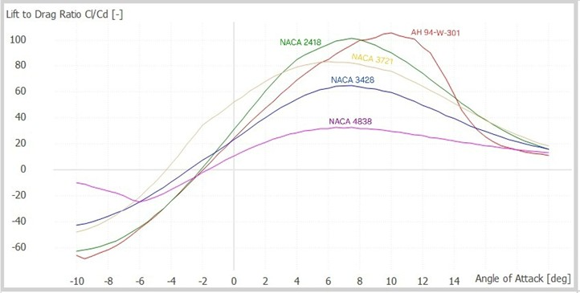

# DSWT
Designing and simulating the wind turbine vensys 170
This group project was developed as part of the "Design and Simulation of Wind Turbines" course at the Technical University of Berlin
## 📌 Overview
The goal of this project is to design the Horizontal Axis Wind Turbine VENSYS 170 and certify it through a selection of relevant aeroelastic load simulations. This is done in a group of 4 people
## 🧰 Tools
- QBlade is mainly used to design the wind turbine, create wind profiles, and run simulations.
- IEC Wind was also used alongside to create wind profiles.
- PDAP alongside a python script is used for post-processing purposes.
## 📅 Project Timeline & Workflow
### 1. Designing the Blade
The first step of the project is designing the blade. Each of the group members is to find suitible airfoils in order to build the most suited blade which could work under the conditions and dimensions given by the manufacturer of the wind turbine. After analyzing their Lift to Drag ratio and Angle of Attacks, the chosen airfoils are NACA 4838 for the root, AH 94-W-301 and NACA 3428 for the mid-span, NACA 3220, NACA 3721and NACA 2418 for the tip.

  

